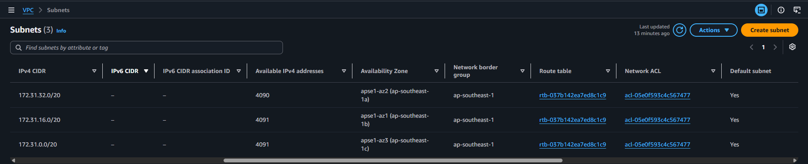
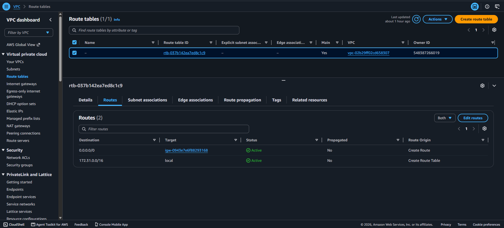
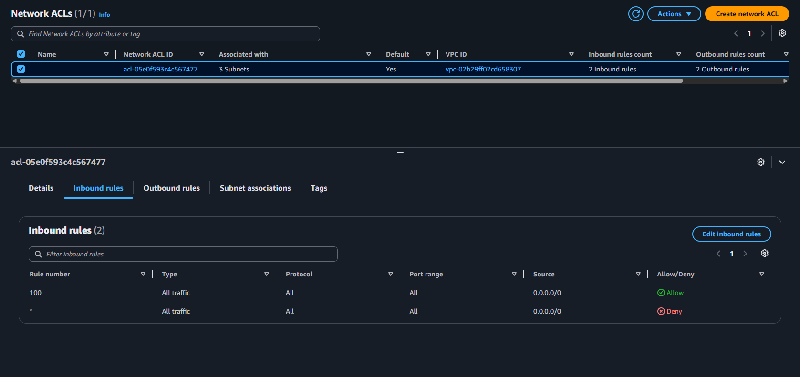
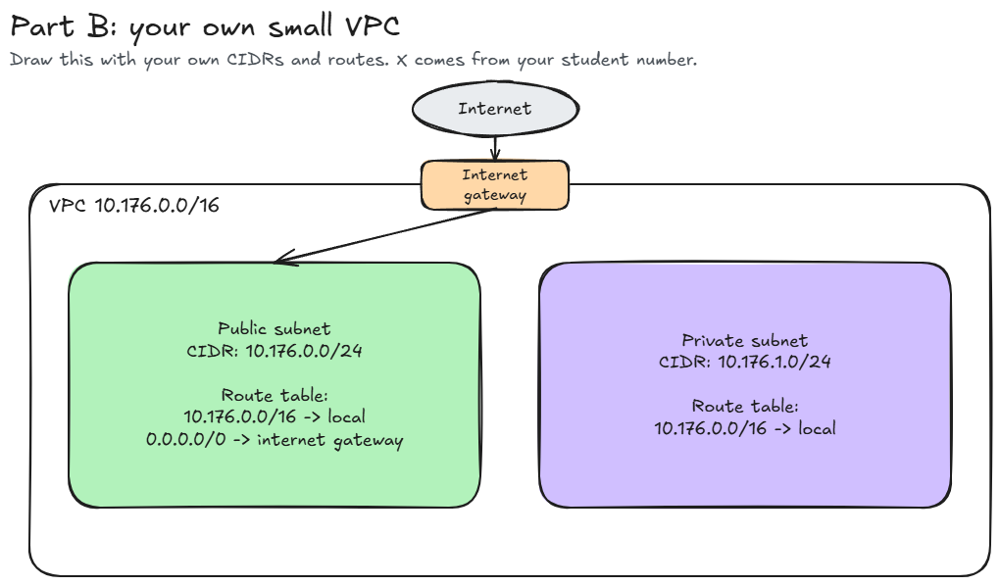

# Assignment 2 Submission

<!--
How to use this template:

1. Copy this file to submissions/assignment-2/<your-github-username>/submission.md
2. Replace every answer placeholder with your own answer. Delete the angle brackets too.
3. Save your four images in the same folder, with the exact file names below.
4. Do not write your full name or your student number in this file.
-->

## About me

- GitHub username: malorian-arms3516
- Section: IV-CCSAD
- IAM user name that I signed in with: ccsad-g06
- X: 176

---

## Part A. Explore

### A1. The VPC

Default VPC IPv4 CIDR:

- 172.31.0.0/16

Number of addresses in that CIDR:

- 65,536

### A2. The subnets

| Availability Zone | IPv4 CIDR |
| --- | --- |
| ap-southeast-1a | 172.31.32.0/20 |
| ap-southeast-1b | 172.32.16.0/20 |
| ap-southeast-1c | 172.31.0.0/20 |

### A3. Available addresses

Available IPv4 addresses in each subnet:

| Subnet | Available addresses |
| --- | --- |
| 172.31.32.0/20 | 4090 |
| 172.32.16.0/20 | 4091 |
| 172.31.0.0/20 | 4091 | 

Why is the number lower than 4,096?

- Subnets ending in `\20` contains a total of 4,096 IPv4 addresses, with 5 of these addresses being reserved by AWS per subnet for networking purposes. for the subnet `172.31.32.0/20`, there is one additional address in use, with the other two remaining subnets correctly showing the remaining available addresses minus the reserved ones, hence the amount showing as 4090 for the first subnet, and 4091 for the other two.

What uses the missing address in the subnet with the lowest number?

- The first subnet, `172.31.32.0/20`, having 4090 available addresses, has an extra address being used as a network interface attached to an EC2 instance on `172.31.37.42`. 

### A4. The route table

| Destination | Target |
| --- | --- |
| 0.0.0.0/0 | igw-0943e7e6f88293168 |
| 172.31.0.0/16 | local |

### A5. Public or private

Are the default subnets public or private? Which route proves it?

- The default subnet is public as it routes towards `igw-0943e7e6f88293168`, which is an internet gateway.

### A6. The internet gateway

State of the internet gateway:

- The internet gateway's state is **Attached**.

What happens to the default subnets if the gateway is detached?

- The default subnets lose their route to the internet provided by `igw-0943e7e6f88293168` gateway, and instances within these subnets can no longer send or receive traffic from the internet through the same gateway. Despite this, internal resources within the VPC can still send traffic through the local route.

### A7. NAT gateways

Number of NAT gateways:

- 0

Can a server in a new private subnet download updates? Why?

- No. In the current VPC, there are currently **0** NAT gateways. A new private subnet will not be able to download updates as it has no route to the internet. Once a NAT gateway is created and internet-bound traffic is sent through its route tables, only then will it be able to download updates that it needs.

### A8. The network ACL

| Rule number | Source | Allow or Deny |
| --- | --- | --- |
| 100 | 0.0.0.0/0 | Allow |
| * | 0.0.0.0/0 | Deny |

How is a network ACL different from a security group?

- A network ACL is **stateless** and is at the **subnet level**, where inbound and outbound traffic is separately evaluated, while a security group is **stateful** and is responsible for controlling traffic for any associated network interfaces or instances, where it automatically allows response traffic to allowed connections.

### A9. The default security group

Inbound rule (type and source):

- The type is **All Traffic** from `sg-0c5b6d4081cf0a534`, and the source is the **default** security group.

Which resources can send traffic to an instance that uses it?

- If a resource is associated with the same default security group in the VPC, it can send traffic to that instance, as the default inbound rule allows for traffic to be sent from that security group, while traffic from every resource in the VPC is not allowed.

---

## Part B. Prepare

### B1. Plan two subnets

- Public subnet CIDR: 10.176.0.0/24
- Private subnet CIDR: 10.176.1.0/24

### B2. Route tables

Route table of the public subnet:

| Destination | Target |
| --- | --- |
| <answer> | <answer> |
| <answer> | <answer> |

Route table of the private subnet:

| Destination | Target |
| --- | --- |
| <answer> | <answer> |

### B3. My VPC diagram

Tool used (Excalidraw, draw.io, Lucidchart, or paper):

**Excalidraw**

### B4. Predict a change

Can you still open the web page from your laptop? Why?

- No, as the instance will fail to communicate with my device over the internet because of 0.0.0.0/0 being removed, even if a public IP exists.

Can the instance still reach another instance in the VPC? Why?

- Communication within the VPC is still possible due to the local `172.31.0.0/16` route still existing, as long as security groups and network ACLs allow for traffic. The removal of the `0.0.0.0/0` route does not affect communications made inside the VPC.

### B5. Place a database

Which subnet gets the database? Why?

- The database is given to the private subnet `10.176.1.0/24`, as it is not possible to be accessed through the internet without an internet gateway route `0.0.0.0/0`. Resources that exist within the VPC can use the local route to connect to the database.

### B6. My question about VPCs

What is your question, and what made you think of it?

- `How can two different VPCs privately communicate with one another without routing traffic through the public internet?`
This activity demonstrated how a VPC's resources communicate with one another, so that made me think about how it would then work when these resources are located in two distinct VPCs.